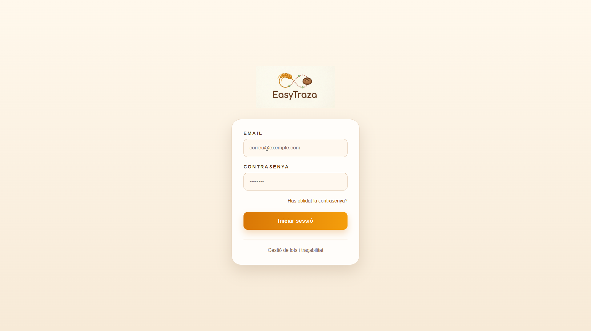

# 🍞 EasyTraza

Aplicació multiplataforma de traçabilitat alimentària desenvolupada amb **Spring Boot**, **Kotlin** i **Jetpack Compose**.

EasyTraza permet gestionar lots, matèries primeres, albarans i traçabilitat de productes alimentaris tant des d’una aplicació web com des d’una aplicació Android.

---

# 📹 Vídeo demostració

[](https://youtu.be/P0cYzjCrlS0D)

---

# 📌 Característiques principals

## 🔐 Seguretat i autenticació
- Login amb usuari i contrasenya
- Recuperació de contrasenya via correu electrònic
- Sessions segures
- Contrasenyes encriptades
- Control d’accés segons rol

---

## 👥 Gestió d’usuaris
- CRUD complet d’usuaris
- Activació/desactivació d’usuaris
- Edició de perfil
- Rol administrador i operari
- Protecció del super administrador

---

## 🏭 Gestió de producció
- CRUD de matèries primeres
- CRUD de productes finals
- CRUD de proveïdors
- CRUD de clients

---

## 📦 Gestió de lots
- Entrada d’albarans de proveïdor
- Creació automàtica de lots
- Inici de lots
- Finalització de lots
- Control d’estats:
  - En estoc
  - Obert
  - Acabat

---

## 🚚 Albarans
### Albarans de proveïdor
- Creació i modificació
- Línies de lots
- Pujada de fitxers

### Albarans de client
- Creació amb múltiples línies
- Associació automàtica de lots oberts
- Estat pendent / lliurat

---

## 🔎 Traçabilitat
- Consulta completa de traçabilitat per lot
- Ordenació per columnes
- Filtres avançats
- Relació entre:
  - lots
  - productes
  - clients
  - albarans

---

## 📊 Estadístiques
- Gràfic mensual de productes venuts
- Resums de producció

---

## 🌍 Internacionalització
- Català
- Castellà

---

## 📱 Aplicació Android
- Desenvolupada amb Kotlin i Jetpack Compose
- Arquitectura MVVM + Clean Architecture
- Configuració persistent de la IP del servidor
- Compatible amb emuladors i dispositius físics

---

# 🛠️ Tecnologies utilitzades

## Backend
- Java
- Spring Boot
- Spring Security
- Spring Data JPA
- Hibernate
- Maven
- MySQL

## Frontend Web
- HTML
- CSS
- Thymeleaf

## Frontend Mobile
- Kotlin
- Jetpack Compose
- Retrofit
- StateFlow
- MVVM

---

# 📂 Estructura del projecte

```text
EasyTraza/
│
├── backend/
│   └── Aplicació Spring Boot
│
├── mobile/
│   └── Aplicació Android Kotlin
│
├── documentacio/
│   └── Documentació AsciiDoc
│
└── README.md
```

---

# 🚀 Execució del projecte

## Backend

Configurar la base de dades a:

```properties
application.properties
```

Executar:

```bash
mvn spring-boot:run
```

---

## Mobile

1. Obrir carpeta `mobile` amb Android Studio
2. Configurar la IP del backend
3. Executar en emulador o dispositiu Android

---

## 📸 Captures de pantalla

### 🖥️ Panell principal PC


---

### 📦 Lots proveïdor PC


---

### 📊 Informe i traçabilitat


---

### 🌐 Configuració IP Mobile


---

### 📱 Login Mobile


---

### 📱 Menú principal Mobile


---

### 📱 Rebre albarà Mobile


---

### 🖥️ Rebre albarà PC


---

### 📱 Tancar lot Mobile


---

# 📖 Documentació

La documentació completa del projecte es troba a la carpeta:

```text
/documentacio
```

Inclou:
- planificació
- sprints
- incidències
- justificacions tècniques
- propostes de millora
- conclusions

---

# 👨‍💻 Autor

**Oriol Naranjo**  
DAM 2 - Projecte EasyTraza

---

# 📜 Llicència

Projecte acadèmic desenvolupat amb finalitats educatives.